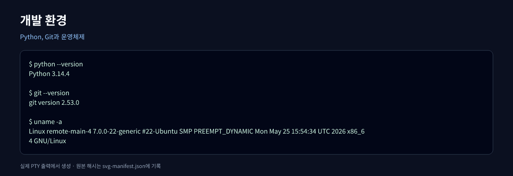
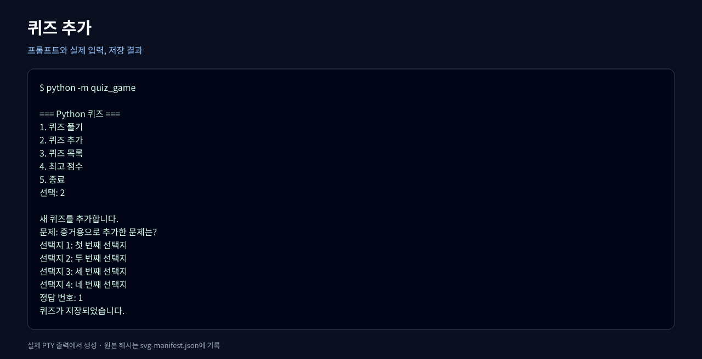
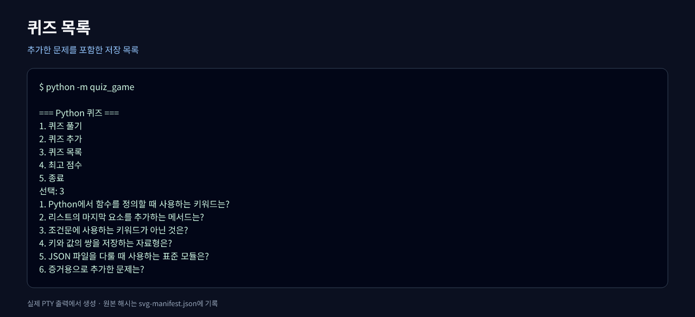
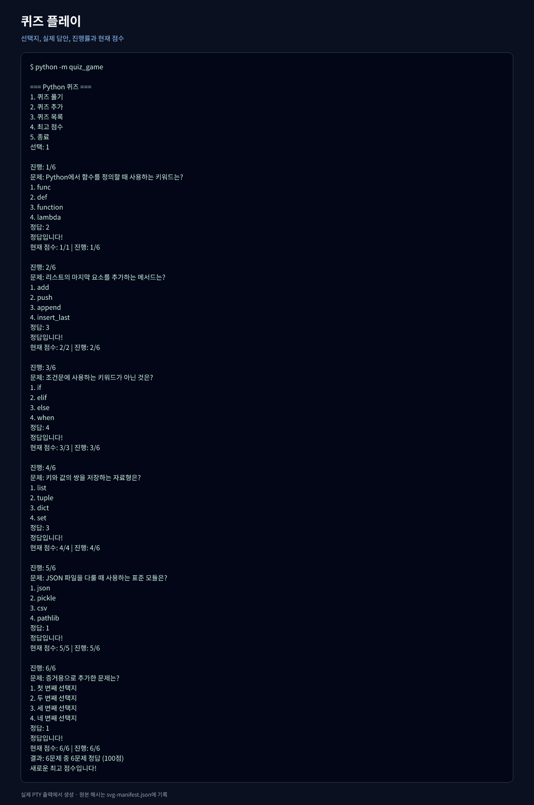
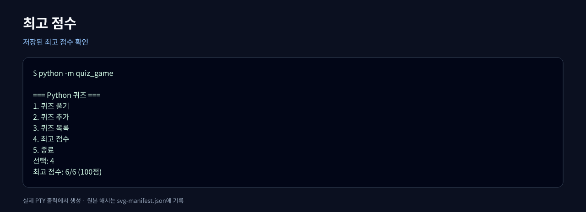
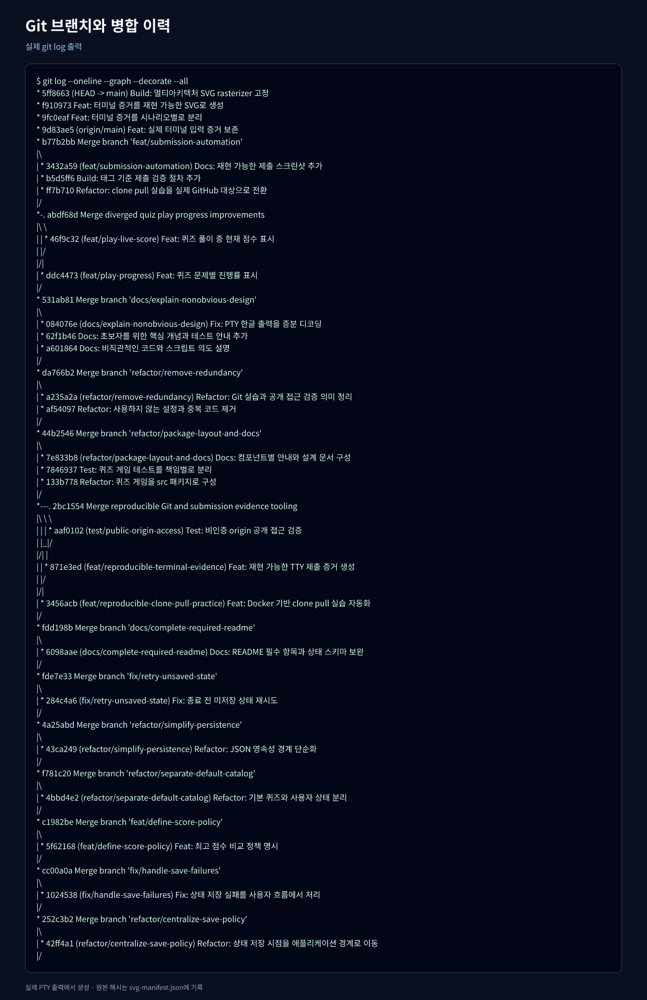
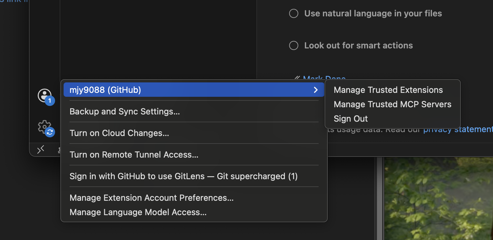

# 제출 자료

## 증거 관리 정책

실행 로그와 스크린샷 같은 생성물은 보통 Git 저장소보다 CI artifact나 Release에 보관하는 편이 좋습니다. 특히 PNG는 diff 검토가 어렵고 저장소 크기를 계속 늘립니다.

이 저장소는 과제가 실행 화면과 개발 환경의 **스크린샷 제출을 명시적으로 요구하기 때문에 예외적으로 `docs/submission/screenshots/`의 PNG를 커밋**합니다. 각 자동 생성 PNG는 실제 PTY 텍스트에서 SVG를 거쳐 만들어지며, 단계별 SHA-256과 고정 resvg·글꼴 버전을 매니페스트에 기록합니다.

## 최종 생성 순서

1. 최종 제출 GitHub 주소를 `origin`에 설정하고 소스, 테스트와 문서를 `main`에 push합니다.
2. `sh scripts/github_clone_pull_practice.sh --execute`로 실제 clone/push/pull 증거 커밋을 만듭니다.
3. 그 커밋까지 제출 가능함을 확인한 뒤 annotated tag를 생성하고 push합니다.
4. 현재 origin과 공개 접근 결과, 자동 스크린샷을 그 tag 기준으로 갱신합니다.
5. 실제 VS Code 환경에서 `vscode-environment.png`를 추가합니다.
6. 생성물을 별도 증거 커밋으로 기록하고 최종 검증을 실행합니다.

```bash
sh scripts/create_submission_tag.sh submission-v1.0 --execute
.venv/bin/python scripts/refresh_submission_metadata.py --revision submission-v1.0
.venv/bin/python scripts/capture_submission_screenshots.py --revision submission-v1.0
.venv/bin/python scripts/verify_submission.py --tag submission-v1.0
```

검증 태그 뒤에 증거 커밋이 생기는 것은 의도된 구조입니다. 자동 검증은 증거 커밋의 `HEAD`가 아니라 명령에 지정한 tag와 매니페스트의 대상 revision을 검사합니다. 제출 원격 주소가 바뀌면 마지막 세 명령 중 메타데이터와 스크린샷 생성 명령을 다시 실행해야 합니다.

VS Code가 없는 환경에서는 중간 확인에만 `--allow-missing-vscode`를 사용할 수 있습니다. 이 옵션 없는 검증이 통과해야 최종 제출 상태입니다.

## 요구 스크린샷

- 
- 
- 
- 
- 
- 
- 

마지막 VS Code 파일은 실제 과제 환경에서 직접 캡처해야 하며 자동 생성하지 않습니다. 최종 제출 검증은 이 파일이 없으면 실패합니다.
